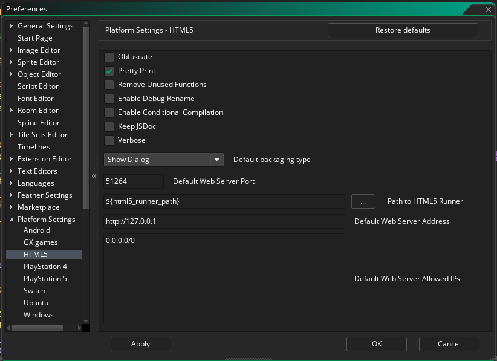
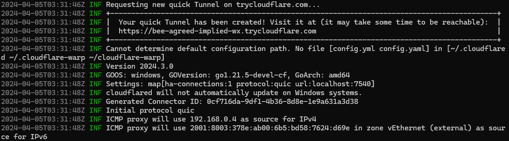
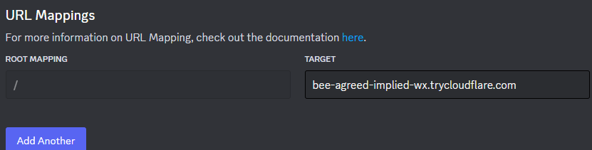
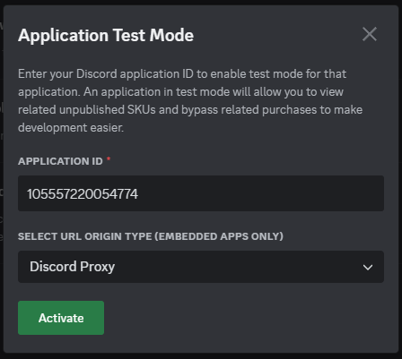

# Getting Started

## Discord Activities?
---

Discord introduced activities in 2022, such as Watch Together, Poker Night, Putt Party, and Fishington.io. In 2024, [they opened the API up](https://discord.com/developers/docs/developer-tools/embedded-app-sdk) so anyone can now develop an activity for Discord! 

GameMaker HTML5 games can be run inside Discord, abd this library helps your game communicate with the main Discord application.


## Installing
--- 
1. Download the latest .yymp from [releases](https://github.com/sidorakh/activity.gml/releases)
2. Open up your GameMaker project and drag the .yymp file into the IDE (or go to the Tools menua nd select Import Local Package)
3. Ensure you import the activities.gml folder in "Extensions", including the library and a sample game


## Setting up
--- 
Important: Make sure to get server code from the [companion server repository here](https://github.com/Sidorakh/activity.gml-server) if you don't have a server component

Server prerequisites:
 - [Node.js v20](https://nodejs.org/en)
 - NPM (comes with Node.js)
 - [cloudflared CLI tool](https://developers.cloudflare.com/cloudflare-one/connections/connect-networks/downloads/)

1. [Create a Discord application](https://discord.com/developers/applications), if you don't already have one
2. Set up activities for it

For the server:

3. Copy the `example.env` file in the server repository to `.env`
   - Set `DISCORD_CLIENT_ID` to your applications Client ID
   - Set `DISCORD_CLIENT_SECRET` to your applications client secret
   - Set `PORT` to an unused port (the default port, `3000`, is usually fine)
   - Set `GAMEMAKER_HTTP_URL` to the URL that opens when you run a HTML5 game in GameMaker. 
     - In GameMaker's preferences - Platform Settings -> HTML5, you can find this URL by combining "Default Web Server Address" and "Default Web server port" 
     - In this example, `GAMEMAKER_HTTP_URL` url should be set to `http://127.0.0.1:51264`
   - Ensure `ENVIRONMENT` is set to `DEV` 
4. Run `npm install` in the server directory
5. Run `node ./server` to start the serverside application
6. In a separate terminal window, run `cloudflared tunnel --url http://localhost:3000`  (replace 3000 with the port you set in step 3 if you changed it)
7. Cloudflared will output a URL that can be used to access the server. 
   - In this screenshot, the url is `bee-agreed-implied-wx.trycloudflare.com`
   - Copy the URL that Cloudflared displayed
8. In the Discord Developers page, open your application, go to URL Mappings under Activities in the sidebar. Put the URl you copied in step 7 in the Target box and hit save 
9. In the Discord application, open User Settings > App Settings > Advanved, and switch on Application Test Mode
   - 
   - 
   - In this window, put in the client ID you used in step 3 into the application ID box, set the URL Origin type to Discord Proxy, then click activate

For the client

10. Call `discord_sdk_setup(CLIENT_ID);` oce at the start of the game, replace `CLIENT_ID` with your applications ID (as a string). 
   - For example: `discord_sdk_setup("1219424590342782987"");`
11. In a Social Async event, enter the following code
```js
var type = async_load[? "type"];
if (type == "DISCORD_READY") {
    discord_sdk_commands_authorize("/api/auth/token",["identify","guilds","rpc.voice.read","rpc.activities.write"]);
}
```
12. Run your game for the HTML5 platform, adn then try to access it in a Discord Voice Channel


